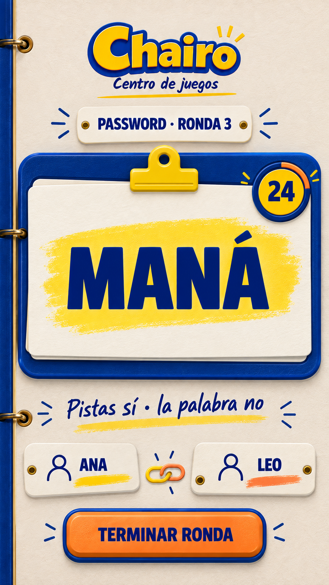

# Password — diseño aprobado y flujo completo

> Estado: **aprobado para implementación**. Dirección vinculante: `02-ficha-sujeta.png`, elegida por el propietario el 17 de septiembre de 2026.

## Decisión visual

La pantalla “MANÁ” es la autoridad visual. Cada palabra vive en una ficha marfil sujeta por un clip amarillo dentro de un marco azul moldeado. El reloj es una pieza pequeña en la esquina superior derecha. Las fichas de Ana y Leo contienen su puntuación acumulada y nunca compiten con la palabra.

La implementación debe conservar el orden, escala relativa y lenguaje material de esta composición. Logo, palabras, nombres, puntuaciones, reloj, QR y controles serán HTML/CSS accesible y responsivo; el PNG es una referencia, no una pantalla para rasterizar.

## Mecánica vinculante

- Partida presencial de exactamente **dos personas y dos teléfonos**: anfitrión e invitado.
- Cada teléfono recibe una palabra diferente. Su propietario lo sostiene sobre la frente y la otra persona da pistas.
- Los dos participantes confirman “Estoy listo/a”; después aparece un 3–2–1 sincronizado y ambas palabras se muestran a la vez.
- El anfitrión configura 30, 45, 60 o 90 segundos por ronda; 60 es el valor inicial.
- El reloj se calcula con una marca de tiempo del servidor. Al llegar a 0 permanece en 0: la ronda solo termina cuando el anfitrión mantiene pulsado **Terminar ronda** durante 600 ms.
- Al cerrar la ronda se ocultan las palabras y el anfitrión anota por separado si cada participante adivinó su propia palabra.
- **Adivinó = +1 punto; no adivinó = +0.** Cada persona puede ganar como máximo un punto por ronda.
- La confirmación de puntos es atómica: se selecciona un resultado para ambas personas y después se pulsa **Guardar puntos**.
- El marcador aparece tras cada ronda. El anfitrión elige Otra ronda o Terminar partida.
- No existe límite de rondas ni meta de puntos en la primera versión. Al terminar gana quien tenga más puntos; los empates se conservan como empate.
- No hay detección de inclinación, reconocimiento de voz, penalizaciones, bonificación por rapidez ni cuentas de usuario.

## Flujo de pantallas

1. **Configuración del anfitrión.** Nombre y tiempo por ronda.
2. **Unirse.** Código, nombre y color del invitado.
3. **Sala.** QR, código, dos asientos, puntuaciones y configuración.
4. **Preparación.** Ambos colocan el teléfono en la frente y confirman estar listos.
5. **3–2–1.** Reutiliza el lenguaje de la cuenta regresiva existente, sincronizada con el servidor.
6. **Ronda.** Una ficha de palabra por teléfono, reloj en esquina, puntuaciones secundarias y cierre solo para el anfitrión.
7. **Anotar puntos.** El anfitrión marca Adivinó/No adivinó para las dos palabras.
8. **Marcador.** Totales y variación de la ronda; otra ronda o terminar.
9. **Resultado final.** Ganador o empate, ambos totales y rondas jugadas.

## Referencias visuales entregadas

| Estado | Archivo | Regla principal |
|---|---|---|
| Configuración | [`01-configuracion-host.png`](01-configuracion-host.png) | Solo nombre y duración; sin dificultad ni número de rondas. |
| Entrada | [`02-unirse.png`](02-unirse.png) | Capacidad exacta de dos personas. |
| Sala | [`03-sala-espera.png`](03-sala-espera.png) | QR y código solo aparecen aquí; puntos visibles por persona. |
| Preparación | [`04-preparacion.png`](04-preparacion.png) | La palabra sigue oculta hasta que ambos estén listos. |
| Ronda | [`05-ronda-palabra.png`](05-ronda-palabra.png) | Composición aprobada con puntuaciones integradas. |
| Anotar puntos | [`06-anotar-puntos.png`](06-anotar-puntos.png) | Dos decisiones obligatorias y una confirmación atómica. |
| Marcador | [`07-marcador.png`](07-marcador.png) | Totales dominantes y variación de la ronda. |
| Resultado | [`08-resultado-final.png`](08-resultado-final.png) | Dos personas, empate permitido y número de rondas. |

Las alternativas `01-tablero-amarillo.png` y `03-palabra-a-distancia.png` quedan únicamente como historial de exploración y no deben guiar la implementación.

## Jerarquía de la ronda

1. **Palabra:** foco dominante y legible a distancia. Se permite una segunda línea solo para frases del banco que no quepan a un tamaño útil.
2. **Reloj:** círculo pequeño en la esquina superior derecha; amarillo en estado normal, naranja con 10 segundos o menos y 0 persistente al agotarse.
3. **Puntuaciones:** una ficha por persona debajo de la instrucción; nombre, color y total.
4. **Acción del anfitrión:** Terminar ronda aparece únicamente en el teléfono anfitrión. En el invitado se sustituye por “La anfitriona controla la ronda”.

## Reglas de puntos y permisos

- El punto pertenece al dueño del teléfono/palabra que fue adivinada, no a quien dio la pista.
- Solo el anfitrión puede iniciar la partida, cerrar una ronda, guardar puntos, abrir otra ronda y terminar la partida.
- El invitado ve en tiempo real “La anfitriona está anotando” durante la fase de puntuación y recibe el marcador cuando se confirma.
- Guardar puntos una segunda vez para la misma ronda no puede duplicarlos.
- Si el anfitrión abandona antes de confirmar, al reconectar recupera las selecciones no guardadas únicamente si siguen en memoria local; la base conserva la ronda sin puntuar.
- Terminar partida solo está habilitado desde un marcador ya confirmado; nunca deja una ronda parcialmente puntuada.

## Banco de palabras

`assets/password.md` es la fuente de contenido y actualmente está vacío. Antes de implementar debe contener una palabra o frase por línea no vacía. El generador debe:

- recortar espacios y conservar tildes y ortografía;
- eliminar duplicados sin distinguir mayúsculas/minúsculas;
- rechazar entradas vacías o mayores de 32 caracteres;
- exigir al menos dos entradas;
- producir `word-bank.generated.ts` de forma reproducible;
- no repetir una palabra dentro de la misma partida hasta agotar el banco;
- reiniciar una bolsa mezclada cuando quedan menos de dos palabras, evitando que las dos palabras de una ronda coincidan.

Se recomiendan 40 palabras o más.

## Adaptación, accesibilidad y feedback

- Prioridad móvil vertical desde 320 px; tabletas y pantallas grandes mantienen una columna centrada, sin añadir paneles laterales.
- Área táctil mínima de 48 × 48 px, foco crema/azul visible y estados seleccionados con icono y texto además de color.
- La pulsación larga de 600 ms muestra progreso alrededor del botón y se cancela si el dedo sale del control.
- El 3–2–1 y los cambios de fase usan `aria-live`; el reloj no se anuncia cada segundo, solo al iniciar, a 10 segundos y al llegar a 0.
- La palabra visual no se lee automáticamente con voz: hacerlo revelaría la respuesta al dueño del teléfono. Se incluye texto accesible que explica la mecánica antes de comenzar.
- Solicitar `Screen Wake Lock` después de Estoy listo/a; degradar sin error si el navegador no lo admite.
- Sonido y vibración breves en 10 y 0 cuando estén disponibles. Respetar movimiento reducido y preferencias de sonido existentes.
- Al reconectar, conservar la palabra ya recibida, mostrar “Reconectando” y corregir el reloj desde `serverNow`/`deadlineAt`.

## Estados y errores obligatorios

- Banco vacío, una sola palabra o banco inválido.
- Creando sala, sala con un lugar, sala completa, partida iniciada y sala cerrada.
- Código inválido, nombre/color ocupado y pérdida de conexión.
- Uno listo, ambos listos, 3–2–1, ronda activa, 10 segundos, 0 segundos y cierre manual.
- Anotación pendiente, selección incompleta, guardando puntos, puntos guardados y doble envío.
- Marcador, siguiente ronda, partida finalizada, empate y jugar otra vez.
- Anfitrión desconectado: tolerancia breve; si no regresa, el invitado recibe una salida clara sin poder apropiarse de la sala.

## Fuente técnica

El contrato detallado de rutas, dominio, Supabase, RPC, seguridad, pruebas y criterios de aceptación está en [`IMPLEMENTATION-HANDOFF.md`](IMPLEMENTATION-HANDOFF.md).

